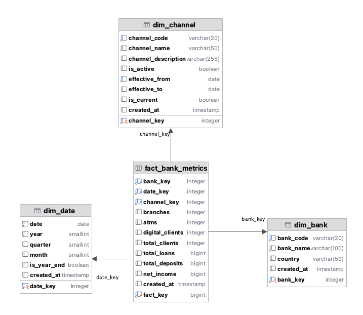

#  BBVA Digital Data Warehouse  
### Star Schema Design for Digital vs Physical Banking Analysis

This project implements a production-style Data Warehouse designed to analyze the structural transformation of banking operations from physical infrastructure toward digital channels.

It focuses on modeling, scalability, and best practices in dimensional design.

---

##  Business Problem

How can we measure and quantify the digital transformation of a financial institution?

This Data Warehouse enables analysis of:

-  Digital penetration growth
-  Branch and ATM structural evolution
-  Client segmentation trends
-  Financial performance indicators
-  Operational efficiency improvements

---

##  Architecture Overview

The solution follows a layered architecture:

RAW → STAGING → DIMENSIONS → FACTS → MART

##  Star Schema Model

<p align="center">
  
</p>

The model is built using a centralized fact table connected to conformed dimensions, optimized for analytical queries and BI consumption.

---

##  Repository Structure

```
bbva-digital-dw/
│
├── migrations/
│   ├── v1__schemas.sql
│   ├── v2__raw_tables.sql
│   ├── v3__staging.sql
│   ├── v4__dimensions.sql
│   ├── v5__facts.sql
│   ├── v6__indexes.sql
│   └── v7__mart.sql
│
├── docker/
│   └── docker-compose.yml
│
├── docs/
│   └── star_schema.png
│
└── README.md
```

---

##  Deployment (Docker)

Run the full database locally:

```bash
docker compose up -d
```

Stop services:

```bash
docker compose down
```

---

##  Data Engineering Practices Applied

-  Star Schema modeling
-  Surrogate keys
-  Separation of analytical layers
-  Version-controlled migrations
-  Index optimization strategy
-  Infrastructure as Code (Docker)

---

##  Analytical Capabilities

This warehouse supports:

- Channel performance comparison
- Digital adoption KPI monitoring
- Structural efficiency analysis
- Time-series financial trend analysis
- BI tool integration (Power BI / Tableau ready)

---

##  Roadmap

- Implement Slowly Changing Dimensions (SCD Type 2)
- Add data quality validation framework
- CI/CD pipeline for migration testing
- Integration with ETL Python layer
- Cloud-ready deployment (AWS / GCP)

---

##  Author

**Sidhartha Manriquez**  
Data Architecture | Data Platforms | Financial Analytics Engineering

---

